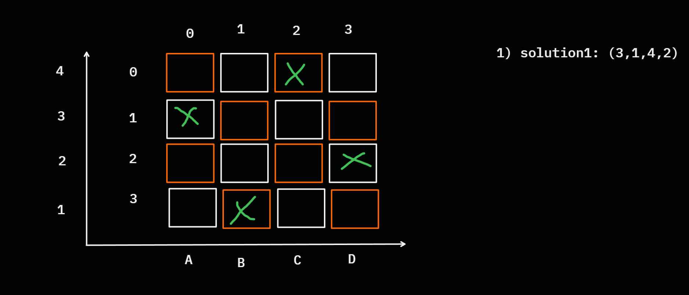
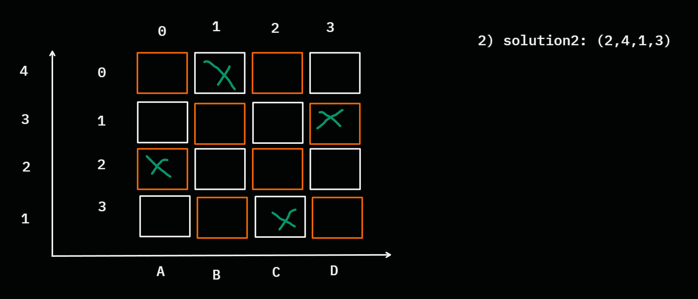
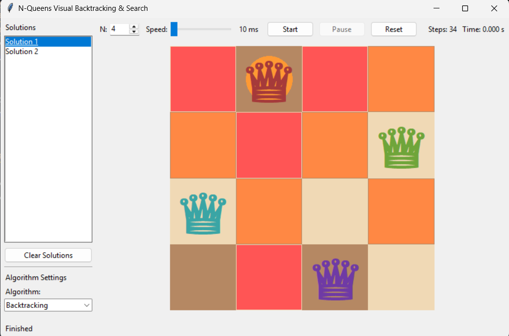
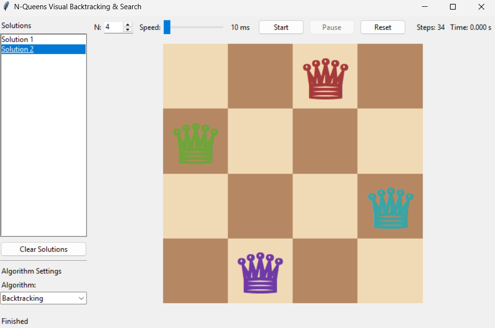

# N-Queen Puzzle ( AI Project )

> [!Note]
> <h3 style="color: rgba(49, 78, 239, 1);">Project Brief</h3>
> This project aim to demonstrate <b style="color:orange">4 algorithms</b> used to solve <i style="color:rgba(100, 116, 235, 1)">N-Queen</i> Puzzle and generate <i style="color: rgba(216, 115, 53, 1)">report</i> on Number of <i style="color: rgba(86, 181, 35, 1)">solutions</i> generated between the 4 algorithms

<table>
<caption>
<b>Table Content</b>
</caption>
<tr>
<th>Content</th>
<th>Link</th>
</tr>
<tr>
<td>Tools</td>
<td><a href='#tools'>View</a></td>
</tr>
<tr>
<td>Demo</td>
<td><a href='#demo'>View</a></td>
</tr>
</table>

<h3 id="tools">Tools</h3>
<div style="display:flex; align-item: center;justify-content: center;flex-wrap:wrap; gap: 0.3rem;">


</div>

<h3 id="demo">Demo</h3>
<div>

<h5>Overview</h5>

> [!Warning]
> <h3 style="color: rgba(201, 170, 15, 1);">Attention</h3>
> This demo is used for educational purposes only.

we use demo in helping to build the heuristics.
like ex:
<pre>
“ for each proposed solution if we reversed the solution <i style="color:orange">(mirrored it)</i> on board we got another solution. “</pre>
<div style="display: flex; flex-direction:row;flex-grow:1;gap: 0.5rem;">


</div>
<h5>Run Demo</h5>
<div>

```python3
python ./demo/demo.py
```

<div style="display: flex; flex-direction:row;flex-grow:1; gap: 0.5rem;">


</div>
</div>
</div>
